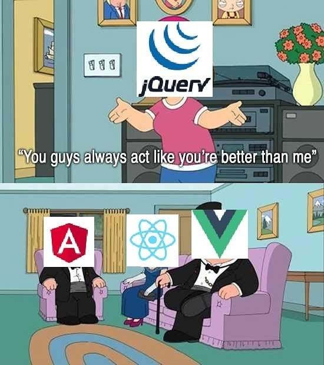
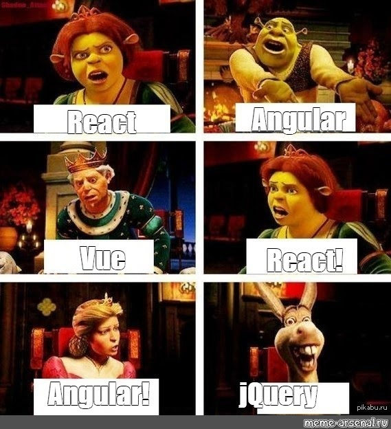
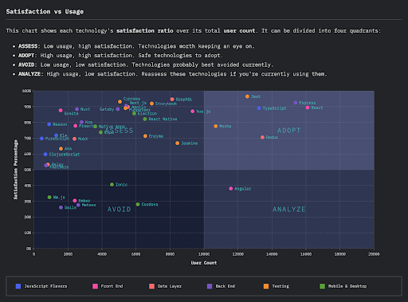
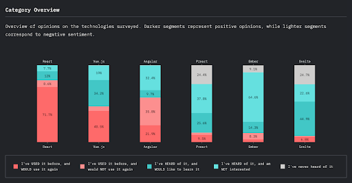
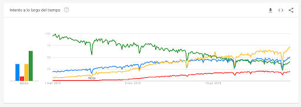

# [Curso de JavaScript avanzado para desarrolladores](https://fictizia.com/formacion/curso-javascript-avanzado)

## Clase 1

- Presentación
- Funcionamiento del curso
- Un poco de historia
- Control de versiones

### Presentación


#### Bio

Coleccionista de líneas de código, funkos, cómics ~~y estrenos de cine~~. Siempre en las nubes ☁️. Back-end developer en zityhub. Profe en [@fictiziaescuela](https://twitter.com/fictiziaescuela).

#### Redes sociales

- 🕊 [@totegsito](https://twitter.com/totegsito)
- 👨🏼‍💻 [Fran Quesada Muñoz](https://www.linkedin.com/in/francisco-quesada-mu%C3%B1oz/)

#### Sobre el curso

- Puntualidad
- Empezamos desde la base.
- Descansos
- Comunicación fuera de clase
- Repositorio común en Github
- Ejercicios

### Evolución de la web

**Los orígenes de internet**


**Nacimiento de JS**


**Guerra de los navegadores**


### Cómo funciona


- HTML es el lenguaje de marcado con el que se hace la web. Define el contenido y la estructura de la web. La W3C es el organismo que se encarga del estándar.
- CSS es el lenguaje de con el que se define el la apariencia de los contenidos. La idea es que la estructura y la presentación vayan por separado. Regulado por la W3C.
- JS es un lenguaje interpretado, multiparadigma, orientado a objetos basado en prototipos. ECMA es el organismo encargado de regular el estándar.

Si bien en un comienzo Javascript sólo se utilizaba para dar "vidilla" al contenido estático de la web, a día de hoy su ámbito ha ido creciendo con los años y a día de hoy su uso ha trascendido. Ya podemos usar Javascript para [programar robots](http://johnny-five.io/), crear herramientas de [línea de comando](https://www.npmjs.com/package/commander) o, incluso, un TODO list 💪🏻. Esto se debe a que en 2009 Javascript trascendió el navegador y nació NodeJS.

- NodeJS es un entorno de ejecución monohilo basado en V8 de Google que permite el uso de Javascript en el lado de Servidor. La asincronía y la comunidad (NPM) son uno de los pilares fundamentales de Node.js.
- Npm es el gestor de paquetes de node escrito en Javascript. Permite integrar y publicar fácilmente cualquier dependencia en los proyectos que usan node. Recientemente comprado por Microsoft.

### Cómo se usa

- Web estática: El caso de uso más antiguo y uno de los más comunes. Un servidor web sirve el contenido estático (HTML + CSS + JS) ya renderizado y el navegador lo muestra. Ideal para proyectos donde el contenido va a variar poco en el tiempo.

- SPA (Single Page Application): En este caso, el servidor sirve siempre el mismo contenido y es el navegador del usuario el que en función del estado de la aplicación renderiza unos contenidos u otros. El 99% de la carga operativa se lleva a cabo en el navegador, el servidor sólo es responsable de servir la aplicación. Este tipo de proyecto es el más común en aplicaciones web donde el SEO no es tan importante ya que el contenido más importante está "escondido" tras un login.

- Pre-rendering SPA: Similar a la anterior, la principal diferencia es que el software se construye en el servidor antes de ser servida.

- SSR (Server Side Rendering): Este tipo de proyecto es una vuelta a las raíces del desarrollo web. Consiste en renderizar los componentes web en el lugar que llegue antes (front o back) y que el navegador sólo se encargue de "hidratarlos" (darles contenido). A este tipo de proyectos también se le conoce cómo aplicaciones isomórficas o universales, ya que el código es JS en ambos extremos. De esta manera, podemos combinar lo mejor de las PWAs con el método clásico de servir la web para tener lo mejor de ambas mecánicas.

- PWA: Es un tipo específico de aplicación que busca emular el comportamiento de las aplicaciones nativas de los Smartphones. Este comportamiento se consigue haciendo uso de las APIs de los navegadores, que permiten, entre otras, acceder a los sensores de los dispositivos o instalarlas en los mismos cómo si fueran aplicaciones nativas. El nivel de exigencia que tienen este tipo de aplicaciones es muy alto ya que tienen que "competir" con otras que están ya instaladas. Esto se consigue minimizando el uso de recursos descargables y el tamaño de los mismos, utilizando Service Workers para cachear el contenido descargado y haciendo uso de las notificaciones push como si de una app nativa se tratase.

### Tooling JS


#### Frameworks 🥊






#### Hablemos de cifras








### Más información

- La guerra de los navegadores [🔗](https://www.emezeta.com/articulos/browser-wars-la-historia-de-la-guerra-de-navegadores)
- The evolution of the web [🔗](http://www.evolutionoftheweb.com/)
- Museo de la web [🔗](http://symbolics.com/museum/)
- What happens when you type a URL in the browser and press enter [🔗](https://medium.com/@maneesha.wijesinghe1/what-happens-when-you-type-an-url-in-the-browser-and-press-enter-bb0aa2449c1a)
- State of JS 2019 [🔗](https://2019.stateofjs.com/)

## Control de versiones

Permite saber qué cambios se han realizado en un proyecto en un punto del tiempo y aplicar distintas operaciones sobre dichos cambios. Permite evitar situaciones tan "heroicas" como [esta](https://www.youtube.com/watch?v=sdlib5zuc3c&feature=youtu.be&t=70). La más utilizada de estas herramientas (y que usaremos en el curso) es git, pero existen distintas alternativas (Subversion, Mercurial, ~~tantos .zip como sea necesario~~).

### Git

Git es, quizás, la herramienta de control de versiones más utilizada en el sector del desarrollo web. El modelo de Git está basado en ramas que parten de un punto común, como si de un arbol se tratase. Sobre este arbol, nosotros iremos guardando cambios en nuestros proyectos a lo largo del tiempo, siempre en una rama, que se irán juntando en algún punto del tiempo. Lo que git guardará siempre será el histórico de cambios en los ficheros, no los ficheros en sí.

**Instalación[🔗](https://git-scm.com/book/es/v2/Inicio---Sobre-el-Control-de-Versiones-Instalaci%C3%B3n-de-Git)**

#### Uso

Una vez instalado, los siguientes comandos nos permitirán obtener información sobre herramienta así como configurarla.

```shell
# Consultar versión de git
git --version

# Configurar git a nivel de sistema (/etc/gitconfig o /usr/local/git/etc/gitconfig)
git config --system

# Configurar git a nivel de usuario (~/.gitconfig)
git config --global

# Configurar git en el proyecto
git config

# Configurar nombre
git config --global user.name "<nombre>"

# Configurar email
git config --global user.email "<email>"

# Leyendo configuración de nombre
git config --global user.name

# Leer configuraciones
git config --global --list
```

Una vez que ya hemos dejado git configurado, podemos empezar a trabajar con él en nuestro proyecto.

Cada cambio, tendrá 3 fases antes de ser guardado definitivamente.

- Working: El cambio está hecho pero aún no está "nominado" para ser guardado.
- Index: El cambio está "nominado" para ser guardado.
- Repository: El cambio ha sido guardado en el repositorio 💪🏻

Por cada cambio que creemos (commit) se generará un código único (Hash) que podremos usar para identificarlos. Es muy importante cuando trabajamos con git que usemos mensajes de commit que sean aclarativos de qué se está guardando para que sea facilmente identificables.

```shell

# Inicializa un proyecto para usar en git en él
git init

# Nominar a un fichero a ser guardado

git add index.js

# Guardar los cambios nominados

git commit -m "Este es el mensaje de commit"

# Nominar a un fichero a ser borrado

git rm index.js

# Ver el histórico de cambios
git log

# Ver qué cambios hay en el repositorio. Muestra qué ficheros han sido nominados y cuales no
git status

```

Además de estas 3 fases, exista otra especial que se llama `stash`. Dicha fase es un almacen donde podemos guardar cambios que no queremos guardar aún en el repositorio, pero que igualmente queremos conservar. Este estado especial funciona como una pila (LIFO).

```shell

# Listas cambios en stash
git stash list

# Guardar cambios en stash
git stash

# Recuperar los últimos cambios guardados pero no los elimina del stash
git stash apply

# Recuperar los últimos cambios guardados borrándolos de la pila
git stash pop
```

Como hemos dicho antes, git está basado en un modelo de ramas. Dichas ramas se pueden crear a partir de cualquier cambio en el repositorio.

```shell
# Lista las ramas
git branch

# Crear una nueva rama
git branch <nombre-rama>

# Cambiar de rama
git checkout <nombre-rama>

# Cambiar a una rama que no existe y crearla
git checkout -b <nombre-rama>

# Borrar una rama
git branch -d <nombre-rama>

# Fusionar la rama que indiquemos con la actual
git merge <rama-objetivo>
```

Una de las reglas de la informática es que siempre hace falta una copia de seguridad en el cloud. Siguiendo esta regla, nos encontramos que podemos persistir nuestros repositorios de código en servidores remotos gracias a servicios como Github, Bitbucket o Gitlab. Si bien estos tres servicios son similares, durante el curso usaremos [Github](https://github.com). Estas copias serán especialmente importantes a la hora de trabajar en equipos.

```shell
# Descargar un repositorio remoto
git clone <direcion>

# Añadir un nuevo entorno remoto
git remote add origin <direccion>

# Añadimos otro remoto porque YOLO
git remote add forked <direccion>

# Vemos qué cambios hay en origin
git fetch origin

# Vemos que cambios hay en forked
git fetch forked

# Nos bajamos los cambios de origin
git pull origin <rama-origin-en-local>

# Nos bajamos los cambios de origin
git pull forked <rama-forked-en-local>

# Subimos nuestros cambios a origin
git push origin <rama-origin-remota>

# Subimos nuestros cambios a origin
git push forked <rama-forked-remota>
```

Conocer los siguientes conceptos serán importantes a la hora de trabajar con Github:

- Issue: Cuando detectemos que en un repositorio hay una carencia de cualquier tipo, podemos crear una nueva Issue. En dicha issue deberemos de informar lo más detalladamente posible qué falta y por qué.

- Pull request: Se trata de una solicitud para integrar el código de una rama en otra. Cada vez que se abra una issue, se crearán 1 o n pull requests con el código que solucione dicha incidencia. Una vez que esta pull request sea aprobada, el código se integrará contra la rama de destino.

# Ejercicio

Es hora de que nos conozcamos un poco más. Para ello haremos lo siguiente:

1. Clonar el proyecto del curso en local

2. Crear una rama dentro del repositorio. Dicha rama se deberá llamar de la siguiente manera: `feat/<tus-iniciales-separadas-por-guiones>`

3. Cambiar a la rama que acabamos de crear.

4. Dentro de la carpeta alumnos, crear otra carpeta con nuestras iniciales en minúsculas.

5. Crear un archivo `README.md` dentro de la carpeta que acabamos de generar.

6. Abrid este archivo en vuestro editor de código favorito y presentaos contando lo siguiente:

  - Nombre y apellidos y cómo prefieres que te llamen. Si eres Bruce Wayne, ya conocemos tu secreto 😉

  - Qué editor de código vas a usar durante el curso y en qué sistema operativo 🖥

  - Qué hobbies tienes. En qué inviertes tu tiempo cuando no estás aprendiendo sobre Javascript.

  - Qué tecnologías conoces y cómo te gustaría utilizarlas. Si tienes algún pet project en marcha o alguna idea que te gustaría montar y te apetece contarla, es el momento 😄

  - Algun libro, serie, película o canción imprescindible para ti.

  - Cómo conociste el curso y qué es lo que más ganas tienes de aprender.

7. Guardad el contenido del fichero y, tras nominarlo a ir al repositorio, guardadlo.

8. Subid el cambio al repositorio remoto.
