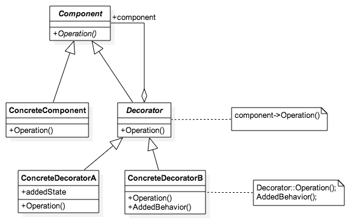

# [Curso de JavaScript avanzado para desarrolladores](https://fictizia.com/formacion/curso-javascript-avanzado)

## Clase 12

- Patrones en JS
  - Factory Method
  - Prototype
  - Singleton
  - Decorator
  - Façade
  - Chain of responsability
  - Iterator
  - Mediator
  - Observer
  - Init-time branching
  - Lazy definition
  - Memoization

# Patrones

> Los patrones de diseño son unas técnicas para resolver problemas comunes en el desarrollo de software y otros ámbitos referentes al diseño de interacción o interfaces.

> Un patrón de diseño resulta ser una solución a un problema de diseño. Para que una solución sea considerada un patrón debe poseer ciertas características. Una de ellas es que debe haber comprobado su efectividad resolviendo problemas similares en ocasiones anteriores. Otra es que debe ser reutilizable, lo que significa que es aplicable a diferentes problemas de diseño en distintas circunstancias. - [Wikipedia](https://es.wikipedia.org/wiki/Patr%C3%B3n_de_dise%C3%B1o)

En resumen:

- Son un catálogo de soluciones para problemas comunes.
- Son agnósticos al lenguaje.
- Estandarizan el diseño de sistemas software.
- Facilitan el aprendizaje.

## Categorías

- Patrones de arquitectura: Reflejan la organización de un sistema software a nivel estructural. Ejemplo de esto serían: `Modelo Vista Controlador`, `Arquitectura de microservicios`, `Programación por capas`, etc
- Patrones de diseño: Relacionados intrínsecamente con las estructuras de diseño de los sistemas software. `Abstract Factory`, `Mediator`, `Singleton`, etc
- Dialectos: Patrones de bajo nivel específicos para un lenguaje o entorno concreto. `Init-time branching` o `Memoization`

## Tipos de Patrones

- **Patrones creacionales**: Nos ayudan a la hora de crear objetos de forma dinámica.
- **Patrones estructurales**: Describen cómo conectar las piezas de nuestro sistemas de forma que sean extensibles.
- **Patrones de comportamiento**: Definen el comportamiento entre objetos de nuestro sistema.

## Patrones de diseño

### Patrones creacionales

- [Abstract Factory](https://es.wikipedia.org/wiki/Abstract_Factory_(patr%C3%B3n_de_dise%C3%B1o)) (Fábrica abstracta): Crea una instancia de varias familias de clases.
- [Builder](https://es.wikipedia.org/wiki/Builder_(patr%C3%B3n_de_dise%C3%B1o)) (Constructor): Separa la construcción del objeto de su representación.
- [Factory Method](https://es.wikipedia.org/wiki/Factory_Method_(patr%C3%B3n_de_dise%C3%B1o)) (Método de fabricación): Crea una instancia de varias clases derivadas.
- [Namespace](https://es.wikipedia.org/wiki/Espacio_de_nombres): Ayudan a reducir el número de variables globales requeridas y evitar el nombramiento de colisiones o el prefijo excesivo del nombre
- [Prototype](https://es.wikipedia.org/wiki/Prototype_(patr%C3%B3n_de_dise%C3%B1o)) (Prototipo): Una instancia completamente inicializada para ser copiada o clonada.
- [Singleton](https://es.wikipedia.org/wiki/Patr%C3%B3n_de_dise%C3%B1o_Singleton) (Instancia única): Una clase de la cual solo una instancia puede existir.

### Patrones estructurales

- [Adapter/Wrapper](https://es.wikipedia.org/wiki/Adapter_(patr%C3%B3n_de_dise%C3%B1o)) (Adaptador/Envoltorio): Adapta interfaces de diferentes clases.
- [Bridge](https://es.wikipedia.org/wiki/Bridge_(patr%C3%B3n_de_dise%C3%B1o)) (Puente): Separa la interfaz de un objeto de su implementación.
- [Composite](https://es.wikipedia.org/wiki/Composite_(patr%C3%B3n_de_dise%C3%B1o)) (Compuesto): Una estructura de árbol de objetos simples y compuestos.
- [Decorator](https://es.wikipedia.org/wiki/Decorator_(patr%C3%B3n_de_dise%C3%B1o)) (Decorador): Agrega responsabilidades a los objetos dinámicamente.
- [Facade](https://es.wikipedia.org/wiki/Facade_(patr%C3%B3n_de_dise%C3%B1o)) (Fachada): Una sola clase que representa un subsistema completo.
- [Flyweight](https://es.wikipedia.org/wiki/Flyweight_(patr%C3%B3n_de_dise%C3%B1o)) (Peso ligero): Reduce la redundancia cuando gran cantidad de objetos poseen idéntica información.
- [Proxy](https://es.wikipedia.org/wiki/Proxy_(patr%C3%B3n_de_dise%C3%B1o)) (Apoderado): Proporciona un intermediario de un objeto para controlar su acceso.
- [Module](https://es.wikipedia.org/wiki/Module_(patr%C3%B3n_de_dise%C3%B1o)) (Módulo): Agrupa varios elementos relacionados, como clases, singletons, y métodos, utilizados globalmente, en una entidad única.
- Revealing Module (Módulo revelado): Es una variante del patrón de módulo que nos asegura un funcionamiento más simple.

### Patrones de comportamiento

- [Chain of Responsibility](https://es.wikipedia.org/wiki/Chain_of_Responsibility_(patr%C3%B3n_de_dise%C3%B1o)) (Cadena de responsabilidad): Una forma de pasar una solicitud entre una cadena de objetos.
- [Command](https://es.wikipedia.org/wiki/Command_(patr%C3%B3n_de_dise%C3%B1o)) (Orden): Encapsula una operación en un objeto, permitiendo ejecutar dicha operación sin necesidad de conocer el contenido de la misma.
- [Interpreter](https://es.wikipedia.org/wiki/Interpreter_(patr%C3%B3n_de_dise%C3%B1o)) (Intérprete): Una forma de incluir elementos de lenguaje en un programa.
- [Iterator](https://es.wikipedia.org/wiki/Iterator_(patr%C3%B3n_de_dise%C3%B1o)) (Iterador): Acceda de forma secuencial a los elementos de una colección.
- [Mediator](https://es.wikipedia.org/wiki/Mediator_(patr%C3%B3n_de_dise%C3%B1o)) (Mediador): Define un objeto que coordine la comunicación entre objetos de distintas clases, pero que funcionando como un conjunto.
- [Memento](https://es.wikipedia.org/wiki/Memento_(patr%C3%B3n_de_dise%C3%B1o)) (Recuerdo): Representa y externaliza el estado interno de un objeto sin violar la encapsulación, de forma que éste puede volver a dicho estado más tarde.
- [Observer](https://es.wikipedia.org/wiki/Observer_(patr%C3%B3n_de_dise%C3%B1o)) (Observador): Define una dependencia de uno-a-muchos entre objetos, de forma que cuando un objeto cambie de estado se notifique y actualicen automáticamente todos los objetos que dependen de él.
- [State](https://es.wikipedia.org/wiki/State_(patr%C3%B3n_de_dise%C3%B1o)) (Estado): Permite que un objeto modifique su comportamiento cada vez que cambie su estado interno.
- [Strategy](https://es.wikipedia.org/wiki/Strategy_(patr%C3%B3n_de_dise%C3%B1o)) (Estrategia): Permite disponer de varios métodos para resolver un problema y elegir cuál utilizar en tiempo de ejecución.
- [Template Method](https://es.wikipedia.org/wiki/Template_Method_(patr%C3%B3n_de_dise%C3%B1o)) (Método plantilla): Aplazar los pasos exactos de un algoritmo a una subclase.
- [Visitor](https://es.wikipedia.org/wiki/Visitor_(patr%C3%B3n_de_dise%C3%B1o)) (Visitante): Define una nueva operación para una clase sin alterarla.

## Factory Method

Permite crear instancias de varias clases que deriven de una clase padre.


> Las clases principales en este patrón son el creador y el producto. El creador necesita crear instancias de productos, pero el tipo concreto de producto no debe ser forzado en las subclases del creador, porque las posibles subclases del creador deben poder especificar subclases del producto para utilizar.

> La solución para esto es hacer un método abstracto (el método de la fábrica) que se define en el creador. Este método abstracto se define para que devuelva un producto. Las subclases del creador pueden sobrescribir este método para devolver subclases apropiadas del producto... - [Wikipedia](https://es.wikipedia.org/wiki/Factory_Method_(patr%C3%B3n_de_dise%C3%B1o))

**Ventajas**

- En lenguajes tipados permite flexibilizar el tipo de los mismos.
- Permite delegar en las subclases la lógica creación.
- Facilita añadir nuevos subtipos.

```javascript
// Version JS
class Vehiculo {
  constructor(tipo) {
    this.tipo = tipo
  }
}

class Coche extends Vehiculo {
  constructor({ tipo, marca, modelo, antiguedad, color }) {
    super(tipo)
    this.marca = marca
    this.modelo = modelo
    this.antiguedad = antiguedad
    this.color = color
  }

  detalles() {
    console.log(`Tu vehículo es un ${this.marca} ${this.modelo} con ${this.antiguedad} años, clase ${this.tipo} y color ${this.color}`);
  }
}

class Furgon extends Vehiculo {
  constructor({ tipo, taraMinima, cargaUtil, volumenCarga }) {
    super(tipo)
    this.taraMinima = taraMinima
    this.cargaUtil = cargaUtil
    this.volumenCarga = volumenCarga
  }

  detalles() {
    console.log(`Tu vehículo tiene una Tara mínima de ${this.taraMinima}. Carga útil de ${this.cargaUtil} y un volumen de carga de ${this.volumenCarga}m3`);
  }
}


class Fabrica {
  fabrica (opciones){
    switch(opciones.tipo) {
      case 'furgon':
        return new Furgon(opciones)
      case 'coche':
        return new Coche(opciones)
    }
  }
}

const fabrica = new Fabrica()

const opcionesCoche = {
    marca: "Land Rover",
    modelo: "Santana Aníbal",
    antiguedad: 35,
    color: "Marrón tierra",
    tipo: "4x4"
};

const miCoche = fabrica.fabrica(opcionesCoche)

const opcionesFurgon = {
    taraMinima: 1200,
    cargaUtil:  768,
    volumenCarga: 4.5,
    tipo: "furgon"
};

const miFurgon = fabrica.fabrica(opcionesFurgon)
```

## Prototype

Permite crear en tiempo de ejecución copias de los prototipos de instancias de clases ya inicializadas.


> Este patrón resulta útil en escenarios donde es preciso abstraer la lógica que decide qué tipos de objetos utilizará una aplicación, de la lógica que luego usarán esos objetos en su ejecución. Los motivos de esta separación pueden ser variados, por ejemplo, puede ser que la aplicación deba basarse en alguna configuración o parámetro en tiempo de ejecución para decidir el tipo de objetos que se debe crear. En ese caso, la aplicación necesitará crear nuevos objetos a partir de modelos. Estos modelos, o prototipos, son clonados y el nuevo objeto será una copia exacta de los mismos, con el mismo estado. Como decimos, esto resulta interesante para crear, en tiempo de ejecución, copias de objetos concretos inicialmente fijados, o también cuando sólo existe un número pequeño de combinaciones diferentes de estado para las instancias de una clase.

> Dicho de otro modo, este patrón propone la creación de distintas variantes de objetos que nuestra aplicación necesite, en el momento y contexto adecuado. Toda la lógica necesaria para la decisión sobre el tipo de objetos que usará la aplicación en su ejecución se hace independiente, de manera que el código que utiliza estos objetos solicitará una copia del objeto que necesite. En este contexto, una copia significa otra instancia del objeto. El único requisito que debe cumplir este objeto es suministrar la funcionalidad de clonarse. [Wikipedia](https://es.wikipedia.org/wiki/Prototipo_(patr%C3%B3n_de_dise%C3%B1o)?oldformat=true)

En JS el método `Object.create()` ya nos proporciona esta funcionalidad:

```javascript
class Coche {
  constructor({ tipo, marca, modelo, antiguedad, color}) {
    this.tipo = tipo
    this.marca = marca
    this.modelo = modelo
    this.antiguedad = antiguedad
    this.color = color
  }

  detalles() {
    console.log(`Tu vehículo es un ${this.marca} ${this.modelo} con ${this.antiguedad} años, clase ${this.tipo} y color ${this.color}`);
  }
}

const opcionesCoche = {
    marca: "Land Rover",
    modelo: "Santana Aníbal",
    antiguedad: 35,
    color: "Marrón tierra",
    tipo: "4x4"
};

const coche = new Coche(opcionesCoche)
const clonCoche = Object.create(coche)

console.log(coche.detalles())
console.log(clonCoche.detalles())
```

```javascript
// Ejemplo sin Object.create
class CochePrototype {
  constructor(modelo, color) {
    this.marca = "Seat";
    this.modelo = modelo || "Ibiza";
    this.antiguedad = 20;
    this.color = color || "rojo";
    this.detalles = function (){
      console.log(`Tu coche es un ${this.marca} ${this.modelo} con ${this.antiguedad} años y color ${this.color}`);
    }
  }

  static clone(color) {
    return new CochePrototype(this.modelo, color);
  }
}


// Comprobaciones
const cocheRojo = new CochePrototype();
const otroCoche = CochePrototype.clone('Azul');
console.log(`¿Es "cocheRojo" una instancia de "constructorCoches"? ${cocheRojo instanceof CochePrototype}`); //true
console.log(`¿Es "otroCoche" una instancia de "constructorCoches"? ${otroCoche instanceof CochePrototype}`); //true
```

## Singleton

Sirve para definir que para una clase sólo puede existir una instancia de la misma.


> Es un patrón de diseño diseñado para restringir la creación de objetos pertenecientes a una clase o el valor de un tipo a un único objeto.

> Su intención consiste en garantizar que una clase sólo tenga una instancia y proporcionar un punto de acceso global a ella. - [Wikipedia](https://es.wikipedia.org/wiki/Singleton)

```javascript
class Singleton {
  constructor () {
    if (!Singleton.instancia) {
      Singleton.instancia = this
    }
    return Singleton.instancia
  }


  metodo1() {

  }

  metodo2() {

  }
}

const instancia = new Singleton()
Object.freeze(instancia)


const otraInstancia = new Singleton()

console.log(instancia === otraInstancia)
```

## Decorator

Permite añadir funcionalidades a los objetos dinámicamente.




```javascript
// Usando
class Coche {
  constructor(color) {
    this.marca = "Seat";
    this.modelo = "Ibiza";
    this.antiguedad = 20;
    this.color = color || 'rojo'
  }

  detalles() {
    console.log(`Tu vehículo es un ${this.marca} ${this.modelo} con ${this.antiguedad} años y color ${this.color}`);
  }
}

const coche = new Coche('rojo')
coche.detalles()

const otroCoche = new Coche( "Azul" );
otroCoche.detalles();

otroCoche.cambiarColor = function(color) {
  this.color = color
}

otroCoche.cambiarModelo = function(modelo) {
  this.modelo = modelo
}

otroCoche.cambiarColor('verde')
otroCoche.cambiarModelo('panda')

otroCoche.detalles()
```

```javascript
// Con clases
class Vehiculo {
  constructor(tipo) {
    this.tipo = tipo
  }

  arranca() { }
}

class Coche extends Vehiculo {
  constructor({ tipo, marca, modelo, antiguedad, color}) {
    super(tipo)
    this.marca = marca
    this.modelo = modelo
    this.antiguedad = antiguedad
    this.color = color
  }

  detalles() {
    console.log(`Tu vehículo es un ${this.marca} ${this.modelo} con ${this.antiguedad} años, clase ${this.tipo} y color ${this.color}`);
  }
}

class Decorator extends Vehiculo {
  constructor(vehiculo) {
    super(vehiculo.tipo) 
    this.vehiculo = vehiculo
  }

  arranca() {
    this.vehiculo.arranca()
  }
}

class DecoradorCoche extends Decorator {
  constructor(coche, velocidadMaxima) {
    super(coche)
    this.velocidadMaxima = velocidadMaxima
  }

  arranca() {
    super.arranca()
    console.log(`Aquí podemos hacer cosas`)
  }

  otroMetodoAdicionalPorquePuedo() {

  }
}


// Sin clases

Coche.prototype.arranca = function() {

}
```

## Façade

Una clase que representa a un subsistema completo.


> Fachada (Facade) es un tipo de patrón de diseño estructural. Viene motivado por la necesidad de estructurar un entorno de programación y reducir su complejidad con la división en subsistemas, minimizando las comunicaciones y dependencias entre estos. [Wikipedia](https://es.wikipedia.org/wiki/Facade_(patr%C3%B3n_de_dise%C3%B1o))

### Ventajas

- Creación de interfaces de alto nivel.
- Muy usado en librerías.
- Oculta el código más complejo.
- Desacoplarnos de código externo.


```javascript

class CPU {
  congelar() { /* code here */ }
  saltar(posicion) { /* code here */ }
  ejecutar() { /* code here */ }
}

class Memoria {
  cargar(posicion, data) { }
}

class DiscoDuro {
  leer(lba, tamanio) {  }
}

/* Facade */

class OrdenadorFacade {
  constructor() {
    this.procesador = new CPU();
    this.ram = new Memory();
    this.hd = new HardDrive();
  }

  arrancar() {
    this.procesador.congelar();
    this.ram.cargar(this.DIRECCION_ARRANQUE, this.hd.leer(this.SECTOR_ARRANQUE, this.TAMANIO_SECTOR));
    this.procesador.saltar(this.BOOT_ADDRESS);
    this.procesador.ejecutar();
  }
}

/* Client */

const ordenador = new OrdenadorFacade();
ordenador.start();
```

## Chain of responsability

Permite anidar solicitudes entre una cadena de objetos.


> El patrón de diseño Chain of Responsibility es un patrón de comportamiento que evita acoplar el emisor de una petición a su receptor dando a más de un objeto la posibilidad de responder a una petición. Para ello, se encadenan los receptores y pasa la petición a través de la cadena hasta que es procesada por algún objeto. Este patrón es utilizado a menudo en el contexto de las interfaces gráficas de usuario donde un objeto puede estar compuesto de varios objetos (que generalmente heredan de una super clase "vista"). [Wikipedia](https://es.wikipedia.org/wiki/Cadena_de_responsabilidad)

```javascript

class Fecha {
  constructor(fecha) {
    this.fecha = fecha || new Date()
  }

  anadeAnio(anios = 0) {
    const anioActual = this.fecha.getFullYear()
    const anio = anioActual + anios
    this.fecha.setFullYear(anio)
    return this
  }

  anadeMes(meses = 0) {
    const mesActual = this.fecha.getMonth()
    const mes = mesActual + meses
    this.fecha.setMonth(mes)
    return this
  }

  format() {
    return this.fecha.toLocaleString()
  }
}
```

## Iterator

Permite el acceso de forma secuencial a los elementos de una coleccion.


> En diseño de software, el patrón de diseño Iterador, define una interfaz que declara los métodos necesarios para acceder secuencialmente a un grupo de objetos de una colección. Algunos de los métodos que podemos definir en la interfaz Iterador son:

> Primero(), Siguiente(), HayMas() y ElementoActual().

> Este patrón de diseño permite recorrer una estructura de datos sin que sea necesario conocer la estructura interna de la misma. [Wikipedia](https://es.wikipedia.org/wiki/Iterador_(patr%C3%B3n_de_dise%C3%B1o))

Desde ES6, en JS existen los iterables. Para hacer que un objeto sea Iterable (tenga un iterador), implementaremos el método `Symbol.iterator` del mismo. Este método deberá devolver un objeto que contenga un método next. Este método, a su vez, tiene que devolver un objeto que contenga la propiedad `value` con el valor sobre el que se está iterando y la propiedad `done` que indicará si se ha acabado la iteración. Además, podemos definir un método `return` dentro del iterador que se usará en caso de que la ejecución del mismo se interrumpa para limpiar variables.

```javascript
class Secuencia {
    constructor( inicio = 0, fin = Infinity, intervalo = 1 ) {
        this.inicio = inicio;
        this.fin = fin;
        this.intervalo = intervalo;
    }
    [Symbol.iterator]() {
        let contador = 0;
        let proximoIndice = this.inicio;
        return  {
            next: () => {
                if ( proximoIndice <= this.fin ) {
                    const resultado = { value: proximoIndice,  done: false }
                    proximoIndice += this.intervalo;
                    contador++;
                    return resultado;
                }
                return { value: contador, done: true };
            },
            return: () => {
                console.log('limpiando...');
                return { value: undefined, done: true };
            }
        }
    }
};
```

## Mediator

Define un objeto que actúa cómo intermediario entre distintas entidades que conforman un conjunto.


> El patrón mediador define un objeto que encapsula cómo un conjunto de objetos interactúan. Este patrón de diseño está considerado como un patrón de comportamiento debido al hecho de que puede alterar el comportamiento del programa en ejecución.

> Habitualmente un programa está compuesto de un número de clases (muchas veces elevado). La lógica y computación es distribuida entre esas clases. Sin embargo, cuantas más clases son desarrolladas en un programa, especialmente durante mantenimiento y/o refactorización, el problema de comunicación entre estas clases quizás llegue a ser más complejo. Esto hace que el programa sea más difícil de leer y mantener. Además, puede llegar a ser difícil cambiar el programa, ya que cualquier cambio podría afectar código en muchas otras clases.

> Con el patrón mediador, la comunicación entre objetos es encapsulada con un objeto mediador. Los objetos no se comunican de forma directa entre ellos, en lugar de ello se comunican mediante el mediador. Esto reduce las dependencias entre los objetos en comunicación, reduciendo entonces la Dependencia de código. - [Wikipedia](https://es.wikipedia.org/wiki/Mediator_(patr%C3%B3n_de_dise%C3%B1o))

```javascript

class Participante {
  constructor(nombre) {
    this.nombre = nombre;
    this.sala = null;
  }

  enviar(mensaje, destinatario) {
    this.sala.enviar(mensaje, this, destinatario);
  }

  setSala(sala) {
    this.sala = sala;
  }

  recibir(mensaje, remitente) {
    console.log(`De ${remitente.nombre}: ${mensaje}`);
  }
}

class Sala {
  constructor() {
    this.participantes = {};
  }

  enviar(mensaje, remitente) {
    for (const clave in this.participantes) {
        if (this.participantes[clave] !== remitente) {//you cant message yourself !
            this.participantes[clave].recibir(mensaje, remitente);
        }
    }
  }

  registrar(participante) {
    this.participantes[participante.nombre] = participante;
    participante.setSala(this);
  }
}

const yoko = new Participante("Yoko");
const john = new Participante("John");
const paul = new Participante("Paul");
const ringo = new Participante("Ringo");

const sala = new Sala();
sala.registrar(yoko);
sala.registrar(john);
sala.registrar(paul);
sala.registrar(ringo);

yoko.enviar("All you need is love.");
yoko.enviar("Te quiero John.");
john.enviar("Yo a ti también.");
paul.enviar("¡¡Idos a un hotel!!");

```

## Observer

Permite observar cambios de estado sobre un objeto notificando a la clase que desea suscribirse a los mismos.


> Observador (en inglés: Observer) es un patrón de diseño de software que define una dependencia del tipo uno a muchos entre objetos, de manera que cuando uno de los objetos cambia su estado, notifica este cambio a todos los dependientes. [Wikipedia](https://es.wikipedia.org/wiki/Observer_(patr%C3%B3n_de_dise%C3%B1o))


```javascript
class Producto {
  constructor(nombre, precio = 0) {
    this._nombre = nombre
    this._precio = precio
    this._observadores = []
  }

  get precio() {
    return this._precio
  }

  set precio(precio) {
    this._precio = precio
    this.notifica()
  }

  registrar(...observadores) {
    this._observadores.push(...observadores)
  }

  desregistrar(observador) {
    this._observadores = this._observadores.filter(el => !(el instanceof observador));
  }

  notifica() {
    return this._observadores.forEach(el => el.actualizar(this._precio))
  }
}

class Tasa {
  constructor(factor = 0.21) {
    this._factor = factor
    this._total = 0
  }

  actualizar(precio) {
    this._total = this._factor * precio
  }

  get total () {
    return this._total
  }
}

class Beneficio {
  constructor(factor = 0.3) {
    this._factor = factor
    this._total = 0
  }

  actualizar(precio) {
    this._total = this._factor * precio
  }

  get total () {
    return this._total
  }
}

const producto = new Producto('Lejia', 3)

const tasa = new Tasa()

const beneficio = new Beneficio()

console.log(tasa.total, beneficio.total)

producto.registrar(tasa, beneficio)

producto.precio = 2

console.log(tasa.total, beneficio.total)
```

## Init-time branching

Este patrón es muy común para prevenir problemas de compatibilidad entre navegadores. Se utiliza, entre otras, para crear funciones cuya funcionalidad pueda variar dependiendo del entorno de ejecución.

```javascript
function getElement(query) {
  if ('jQuery' in window) {
    getElement = $
  } else {
    getElement = function() {
      return document.querySelector(query)
    }
  }
  return getElement(query)
}
```

## Lazy Definition

> En la teoría de lenguajes de programación, La evaluación perezosa (del inglés lazy evaluation) o llamada por necesidad es una estrategia de evaluación que retrasa el cálculo de una expresión hasta que su valor sea necesario, y que también evita repetir la evaluación en caso de ser necesaria en posteriores ocasiones. Esta compartición del cálculo puede reducir el tiempo de ejecución de ciertas funciones de forma exponencial, comparado con otros tipos de evaluación. [Wikipedia](https://es.wikipedia.org/wiki/Evaluaci%C3%B3n_perezosa)


```javascript
async function getConfig() {
  // Realizamos una operación costosa
  const config = await fetch('https://randomuser.me/api/')
  // Sobreescribimos la función
  getConfig = function() {
    return config
  }

  return getConfig()
}
```

## Memoization

Es un mecanismo para almacenar el resultado de llamadas a funciones que ya hayamos realizado previamente. En algoritmos que tengan un gran coste computacional, como puedan ser los algoritmos recursivos, esta técnica permite optimizar el coste de los mismos en gran medida. Su uso está muy extendido en algoritmos recursivos y en programación funcional.


```javascript
function memoize(fn) {
    const cache = {};

    return function(...args) {
        const key = JSON.stringify(args);

        if (cache[key]) {
            return cache[key];
        }

        const result = fn(...args);

        cache[key] = result;

        return result;
    }
}

function fib(n) {
    if (n < 2) {
        return n;
    }

    return fib(n - 1) + fib(n - 2);
}

const memoizedFib = memoize(fib);

console.time('no memo')
fib(30)
console.timeEnd('no memo')

console.time('memo')
memoizedFib(30)
console.timeEnd('memo')
```

## Recursos

- [es6-design-patterns](https://loredanacirstea.github.io/es6-design-patterns/#factory-method)
- [Learning Javascript design Patterns - Addy Osmani](https://addyosmani.com/resources/essentialjsdesignpatterns/book/)
- [dofactory](https://www.dofactory.com/javascript/design-patterns)
