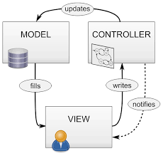
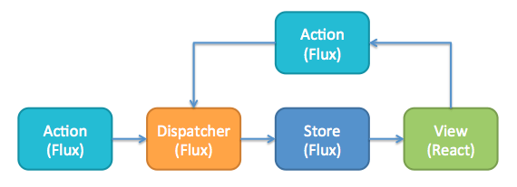
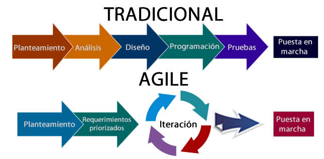

# [Curso de JavaScript avanzado para desarrolladores](https://fictizia.com/formacion/curso-javascript-avanzado)

## Clase 14

- Patrones en JS
  - Principios de diseño
  - Patrones de Arquitectura
    - MVC
    - MVVM
    - Flux
  - Antipatrones

## Principios de diseño

- **SoC**: Separation of concerns. Separa la lógica de tu diseño por preocupaciones.
- **DRY**: Don't repeat yourself. Evita duplicar lógica. A menudo tendemos a copiar piezas de software sin tener en cuenta que podemos reutilizar lógica.
- **KISS**: Keep It simple, Stupid!. Hay que evitar las soluciones excesivamente complejas. La sobreingeniería nunca es una solución.
- **YAGNI**: You ain't gonna need it. No implementes algo que no ncesites porque exista la posibilidad de usarlo en el futuro.
- **Regla del Boy Scout**: Siempre hay que dejar las cosas mejor de lo que las encontramos.

## Patrones de Arquitectura

### Modelo-Vista-Controlador (MVC)

> Modelo-vista-controlador (MVC) es un patrón de arquitectura de software, que separa los datos y principalmente lo que es la lógica de negocio de una aplicación de su representación y el módulo encargado de gestionar los eventos y las comunicaciones. Para ello MVC propone la construcción de tres componentes distintos que son el modelo, la vista y el controlador, es decir, por un lado define componentes para la representación de la información, y por otro lado para la interacción del usuario.1​ Este patrón de arquitectura de software se basa en las ideas de reutilización de código y la separación de conceptos, características que buscan facilitar la tarea de desarrollo de aplicaciones y su posterior mantenimiento. - [Wikipedia](https://es.wikipedia.org/wiki/Modelo%E2%80%93vista%E2%80%93controlador)

**Algunas claves**:

- Su origen viene de las interfaces gráficas para escritorio.
- Separa los datos y la lógica de negocio
- Se compone del modelo, la vista y el controlador
- Facilita enormemente la reutilización de código en un mismo proyecto
- Muy recomendable en casos en los que no exista binding.

### Partes

- Modelo
  - Representa la información que manejamos en el sistema.
  - Se encarga de enviar la información a la vista.
  - Encapsula la lógica de negocio.
- Vista
  - Muestra la información al usuario
  - No debería contener lógica de negocio.
  - La vista se comunica con el controlador.
  - Es responsable de actualizarse cuando se producen cambios en el modelo.
- Controlador
  - Responde a los eventos de la vista y genera cambios en el modelo.
  - Es invocado desde la vista.

### Disclaimer

Si bién este modelo está ampliamente extendido (MVC en .NET, Rails en Ruby, Spring en Java, AngularJS en JS,...), implementar esta arquitectura es bastante costoso, por lo que acabaron naciendo distintas variaciones sobre el mismo.

### Ejemplo

- [Tania Rascia - MVC](https://github.com/taniarascia/mvc)

## Modelo Vista VistaModelo

**Algunas claves**:

- Se trata de una variación del MVP.
- La vista es la que actualiza el modelo y este, a su vez, puede modificar la vista.
- Depende de que el sistema tenga integrado el data-binding.
- Recomendado en sistemas donse se vaya a producir una gran interacción.

### Partes

- Modelo:
  - Igual que el Modelo de MVC
- Vista:
  - Vista sencilla y simple
  - Sólo contiene elementos UI
  - Se comunica con el ViewModel a través de data-binding.
- Vista-Modelo (ViewModel)
  - Debe ser único por vista.
  - Se encarga de realizar los cambios en el modelo y los notifica a la vista.
  - Es el encargado de hacer transformaciones de datos que vengan del modelo para que la vista los represente.

## Flux

**Algunas claves**:

- Presentada por Facebook, está diseñada para sustituir a MVVM.
- Llegó para solucionar los problemas derivados de la comunicación bidireccional entre los modelos y los controladores.
- El flujo de datos es **unidireccional**.
- Muy extendido gracias a, entre otros, React.

### Partes

- Vista:
  - Al igual que en MVC, contiene los componentes de interfaz.
- Store:
  - Contiene los datos/estados de la aplicación (Modelo).
  - Puede haber más de uno.
  - El store no contiene ningún tipo de operación.
- Acciones:
  - Son mensajes en forma de objeto.
  - Cada acción se identifica con un nombre.
  - Pueden contener información adicional.
- Dispatcher:
  - Recibe las acciones y se encarga de procesarlas o enviarlas al store por orden de llegada.

### Disclaimer

El mayor representante de este patrón es la librería Redux. No obstante, esta tiene ciertas peculiaridades:

- Store único.
- El estado es inmutable, es decir, los datos se van reemplazando según llegan acciones.
- En vez de procesar las acciones en los dispatchers, se utilizan funciones puras (reducers) que devolverán un nuevo estado.

### Ejemplo

- [Flux example - kinsomicrote](https://codepen.io/kinsomicrote/pen/mdboLgX)
- [Redux](https://redux.js.org/basics/example)

## Antipatrones

Si bien los patrones nos dan un catálogo de soluciones para ciertos problemas comunes, los antipatrones nos señalan malas soluciones que debemos evitar a la hora de construir software. Los antipatrones reflejan errores de todo el proceso de desarrollo software, desde gestión hasta la parte más puramente técnica.

- **Antipatrones de gestion**:
  - **Humo y espejos**: Vender como hechas cosas que aún ni has empezado.
  - **Mala gestión**: Gestionar un proyecto sin tener suficientes conocimientos sobre lo que trata.
  - **Software inflado**: Permitir que las sucesivas versiones de un sistema exijan cada vez más recursos.
- **Antipatrones de diseño**:
  - **Gran bola de lodo (Big ball of mud)**: Construir un sistema sin ningún tipo de estructura.
  - **Entrada chapuza (Input kludge)**: Admitir cualquier entrada en tu sistema sin validar.
  - **Clase Gorda (Blob)**: Dotar a una entidad de software de demasiada lógica.
  - **Objeto Dios (God Object)**: Concentrar demasiada funcionalidad en una clase.
  - **Objeto sumidero (Object cesspool)**: Reutilizar piezas que no sirven exactamente para el fin que se persigue.
- **Antipatrones de Programación**:
  - **Hardcode**: Mantener en el código datos "a piñón" que no deberían estar ahí
  - **Nomenclatura de heroes (heroic naming)**: Ocultar un mal diseño usando una nomenclatura muy técnica.
  - **Ancla de barco (Boat anchor)**: Retener partes de un sistema que ya no son necesarias.
  - **Complejidad no necesaria (acccidental complexity)**: Complejizar en exceso una solución.
  - **Código espagueti (spaghetti code)**: Desarrollar código demasiado enrevesado sin necesidad o que no tenga ningún tipo de estructura.
  - **Confianza ciega (blind faith)**: No realizar comprobaciones sobre como funciona una solución dando por hecho que estará bien.
  - **Lava seca (lava flow)**: Entregar un software antes que esté finalizado o probado ya que esto provoca que no se pueda modificar por problemas de retrocompatibilidad.
  - **Ocultación de errores (error hiding)**: Capturar errores para que no los vea el usuario, ocultándolos o mostrando mensajes que no tengan nada que ver.
- **Antipatrones de metodología**:
  - **Bala de plata (silver bullet)**: Dar por hecho que la solución técnica que a nosotros más nos gusta puede resolver problemas mucho mayores de para los que está diseñados.
  - **Desarrollo dirigido por el tester**: Definir los nuevos desarrollos en base a los informes de errores.
  - **Martillo de oro (Golden Hammer)**: Asumir que existe una solución que puede solucionar cualquier problema de forma universal.
  - **Programar por copia y pega (copy and paste programming)**: También conocida como StackOverflow Programming. Copiar y pegar bloques de código en vez de crear soluciones genéricas.
  - **Programar por permutación (Permutation programming)**: Intentar llegar a una solución modificando una y otra vez el mismo código para ver si funciona.
  - **Reinventar la rueda (reinventing the wheel)**: Afrontar cualquier problema desde cero, sin tener en cuenta que puedan existir ya soluciones para resolver tus problemas.
- **Antipatrones organizacionales**:
  - **Alcance incremental (scope creep)**: Permitir que el alcance de un proyecto crezca sin el control adecuado.
  - **Dependencias con proveedores (vendor lock-in)**: Construir un sistema que dependa en exceso de un componente proporcionado por un tercero.
  - **Diseño en comité (design by committee)**: Contar con demasiadas voces a la hora de diseñar sin llegar a un punto en común.
  - **Escalada de compromiso (escalation of commitment)**: No dar marcha atrás a una decisión pese a que no acertada.
  - **Funcionalitis creciente (creeping featuritis)**: Dedicarse a hacer nuevas funcionalidades de un producto sin dedicar tiempo a la calidad del mismo.
  - **Gestión basada en números**: Dejar que los criterios puramente cuantitativos sean los que marquen las decisiones sin tener en cuenta los cualitativos.
  - **Gestión de champiñones**: Ocultar información a los empleados manteniéndoles en la ignorancia sobre decisiones que les afectan.
  - **Gestión dictatorial (management by perkele)**: Gestionar de forma autoritaria sin tener en cuenta opiniones de los empleados.
  - **Obsolescencia continua**: Sobreesforzarse para que un sistema obsoleto siga funcionando.
  - **Muerte por análisis**: Dedicar demasiado tiempo al análisis sin comenzar a ejecutar.
  - **Gallina de los huevos de oro**: Dejar de crear nuevos productos porque posees un producto legacy que es muy lucrativo.
- **Otros**:
  - **Fiesta de los bocazas (Blowhard Jamboree)**: Dejarse llevar por el hype generado en charlas, artículos, etc de expertos a la hora de tomar deciciones técnicas.
  - **Culto al carguero (cargo cult)**: Consiste en copiar ciertas prácticas que podrían ser consideradas (no siempre) buenas prácticas sin saber muy bien los beneficios o ventajas que proporcionan, provocando esfuerzo innecesario en el proyecto para incorporarlas o problemas.
  - **El traje nuevo del emperador (emperor's new clothes)**: Temor a señalar los defectos de un producto o proceso que un gerente o mánager cree que funciona bien.
  - **Cultura del miedo**: Ambiente en el que cada empleado tiene miedo de mostrar el resultado de su trabajo por miedo a ser despedido por tener errores.
  - **Cultura del héroe**: Consiste en delegar toda la responsabilidad del éxito de un proyecto en una o pocas persona
  - **Maníaco del control (control freak)**: El deseo de control lleva a la microgestión y ésta a su vez a una pérdida importante de la capacidad de autogestión del equipo, ya que todos los pasos se miden milimétricamente.
  - **Presunto heredero (heir apparent)**: Cuando vemos que los posibles huecos que podrían quedar para seguir progresando en nuestra organización tienen ya nombres y apellidos (cuando además sus méritos son más que discutibles), provocará la salida de la organización en busca de otras alternativas o se producirá una pérdida de motivación que impactará directamente en la productividads.
  - **Quiero estimaciones ahora (give me estimates now)**: Pedir estimaciones sin tener suficientes datos para hacerlas.
  - **Violencia intelectual (intellectual violence)**: De manera interna en un equipo de trabajo o en una reunión con el cliente y/o con usuarios se utilizan términos, generalmente técnicos, que no son comprendidos o conocidos por la mayoría de los interlocutores.

