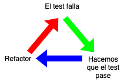

# [Curso de JavaScript avanzado para desarrolladores](https://fictizia.com/formacion/curso-javascript-avanzado)

## Clase 15

- Testing en JS
  - Tipos de Tests
  - Testing en la práctica
  - Testing en JS
  - Metodologías

## Testing

Ya sea para un proyecto personal o para clientes, cuando desarrollamos siempre tenemos que intentar mantener unos mínimos de calidad. Existen diversas formas de asegurar la calidad del software, en este bloque nos centraremos en una de las más importantes: las pruebas. El testing consiste en la realización de pruebas sobre el software que construimos con el fin de garantizar la calidad del mismo. Cuando estamos realizando pruebas, nuestro foco no debe ser comprobar cuando las cosas funcionen, sino que debemos buscar los casos de error.

### Tipos

- Según su ejecución
  - **Manuales**, requieren de intervención humana.
  - **Automáticas**, la propia máquina es capaz de realizar las pruebas sin sufrir alteraciones.
- Según el enfoque:
  - **Caja negra**: Nos centramos en las entradas y salidas de un sistema y no en su código.
  - **Caja blanca**: Nos centramos en como funciona el sistema más qué recibe.
- Según el nivel:
  - **Unitarios**: Son pruebas diseñadas para piezas de codigo atómicas que nos permiten comprobar los posibles resultados del mismo.
  - **Integración**: Nos permiten comprobar el funcionamiento de un conjunto de piezas una vez que están integradas.
  - **Aceptación**: Comprueban si el comportamiento del sistema es el indicado.
  - **End-To-End Testing**: Sirve para probar flujos completos de una aplicación
  - **Regresión**: Tras un despliegue de nuevas funcionalidades, estas pruebas permiten comprobar que el sistema funciona correctamente.
  - **Seguridad**: Los famosos "hacking éticos". Consiste en buscar vulnerabilidades de software en el sistema.
  - **Smoke testing**: Es una revisión previa a la entrega de un producto.
  - **Stress**: Consiste en intentar saturar el sistema para comprobar cuales son sus límites.
  - **A/B Testing**: Muy utilizado en research. Consiste en presentar dos versiones de un sistema y ver cual de ellas es más efectiva.
  - **Snapshot**
  - **Rendimiento**
  - **Carga**
  - **Accesibilidad**
  - **Usabilidad**

### Testing en la práctica

- En los tests todo está permitido.
- Deben poder realizarse de manera automática.
- Cubrir mayor cantidad de casos de uso posibles.
- Independientes entre si.
- Capaces de ejercutarse infinidad de veces.
- Pueden agruparse en Test Suites.
- Uso de colores y mensajes claros.

### Testing en JS

Si bien podemos escribir tests en JS de forma artesanal usando herramientas nativas, la realidad es que ya existen herramientas de terceros que hacen muy bien su trabajo en cuanto a testing se refiere. Entre las más extendidas, encontraremos las siguientes:

- **[Jest](https://jestjs.io/docs/en/getting-started.html)**: Solución completa para el testing en JS.
- **[Mocha](https://mochajs.org/)**: Framework de testing para browser y node.
- **[chai](https://www.chaijs.com/)**: Librería de aserciones que se puede integrar con cualquier framework de testing.
- **[Cypress](https://www.cypress.io/)**: Framework para testing e2e.
- **[ESLint](https://eslint.org/)**: Análisis de código estático. Permite identificar patrones en el código escrito.
- **[Sinon](https://sinonjs.org/)**: Proporciona herramientas de testeo como puedan ser spies, stubs o mocks.
- **[Istanbul](https://istanbul.js.org/)**: Herramienta para instrumentalización de tests. Proporciona información sobre qué partes del sistema están testeadas y cuales no y en qué porcentaje.
- **[Faker.js](https://github.com/marak/Faker.js/)**: Librería para la generacion de datos fake.
- **[proxyquire](https://www.npmjs.com/package/proxyquire)**: Permite sobreescribir dependencias de terceros para los tests.

### Tipos de Tests

- **Unitarios**: Este tipo de tests buscan comprobar que una pieza independiente de código funciona de la manera correcta. Este tipo de tests tienden a tener un enfoque de caja negra. Esto implica que toda dependencia externa que haya en el código que estemos testeando, tendrá que estar bajo nuestro control. Esto significa que tendremos que, en muchos de los casos, tendremos que "mockear" dependencias.
  **¿Cuando se utilizan estos tests en Javascript?**: Cuando no tenemos que lidiar con HTML, es decir, librerías de código, NodeJS en el back, utilidades de código puramente JS.

- **Integración**: Sirven para probar cómo se comportan piezas atómicas de software cuando se juntan. Este tipo de tests tienden a ser más mucho más costosos que los unitarios, pero prueban de forma mucho más completa el sistema. En este tipo de tests, no debemos de mockear dependencias salvo circunstancias excepcionales ($).
  **¿Cuando se utilizan estos tests en Javascript?**: Cuando escribimos código JS en Node, escribimos librerías de código JS que no es atómico.

- **Snapshot testing**: Nos permite comprobar que los cambios realizados en código no provocan cambios inesperados en la interfaz.
  **¿Cuando se utilizan estos tests en Javascript?**: Cuando usamos frameworks donde nuestro código JS se mezcla mucho con la parte visual.

- **e2e testing**: Son tests orientados a probar un sistema completo, desde el front hasta el backend. Esto se hace usando software que permita simular la acción humana sobre los sistemas. Son, con diferencia, los tests más completos que se pueden realizar, pero también son los más costosos. Dado que su coste es tan alto, es importante priorizar qué partes del sistema son más críticas.
  **¿Cuando se utilizan estos tests en Javascript?**: Cuando podemos permitírnoslos.

### Metodologías

#### TDD



> Desarrollo guiado por pruebas de software, o Test-driven development (TDD) es una práctica de ingeniería de software que involucra otras dos prácticas: Escribir las pruebas primero (Test First Development) y Refactorización (Refactoring). Para escribir las pruebas generalmente se utilizan las pruebas unitarias (unit test en inglés). En primer lugar, se escribe una prueba y se verifica que las pruebas fallan. A continuación, se implementa el código que hace que la prueba pase satisfactoriamente y seguidamente se refactoriza el código escrito. El propósito del desarrollo guiado por pruebas es lograr un código limpio que funcione. La idea es que los requisitos sean traducidos a pruebas, de este modo, cuando las pruebas pasen se garantizará que el software cumple con los requisitos que se han establecido. [Wikipedia](https://es.wikipedia.org/wiki/Desarrollo_guiado_por_pruebas)

##### Claves

- Implementar sólo lo que necesitemos.
- Pensar en los posibles fallos antes de escribir el código.
- Crear piezas reutilizables.

##### Como funciona

Cuando creamos software usando esta metodología, los tests serán lo primero que escribamos, y será nuestro código el que se adaptará a los mismo. De esta forma, el desarrollo se convertirá en un ciclo de tres fases que no se acabará hasta que la funcionalidad esté acabada. Las fases de este ciclo serán las siguientes:

1. Red: El test falla. El código que tenemos no cumple con la batería de tests.
2. Green: El test ha pasado. Hemos escrito el suficiente código para que los tests pasen.
3. Refactor: Refactorizamos el código tanto cómo veamos necesario.

#### BDD

Behavior Driven Development, es una evolución de TDD. Si bien TDD se centraba en cómo funciona el código, BDD va un paso más allá y se centra en cómo funciona el sistema. En esta metodología, se define cómo se debe comportar el software una vez que está funcionando. En esta metodología, antes de desarrollar se escribirán las **historias de usuario**, que serán la especificación del comportamiento deseado del sistema. Estas historias segurián un formato 'Give-When-Then', donde se especifica el escenario que estamos comprobando, las condiciones en las que ocurre y el resultado esperado.

```gherkin
Historia: Usuario añade productos al carrito

  Escenario:  Usuario añade un producto al carrito vacío
    Cuando: El usuario visite el carrito
    Entonces: El usuario verá el producto en el carrito con cantidad 1

  Escenario: Usuario añade un producto que ya está en el carrito
    Cuando: El usuario visite el carrito
    Entonces: El usuario verá el producto en el carrito con cantidad 2
```

Esta metodología de desarrollo, está muy ligada con Cucumber, un framework de testing orientado a BDD donde las historias de usuario se escriben en un lenguaje llamado `Gherkin`. Dichas historias, una vez escritas, generarán el código de pruebas por nosotros. La ventaja de esta metodología es que nos fuerza a pensar cómo se comportará el usuario en el sistema.

##### Recursos

- [BDD automated testing con gherkin y jest](https://dev.to/imsergiobernal/bdd-automated-testing-con-gherkin-y-jest-en-node-js-3hjg)
- [js testing best practices](https://medium.com/@me_37286/yoni-goldberg-javascript-nodejs-testing-best-practices-2b98924c9347)
