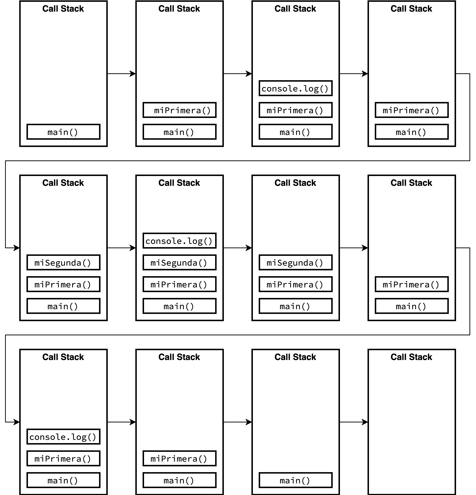
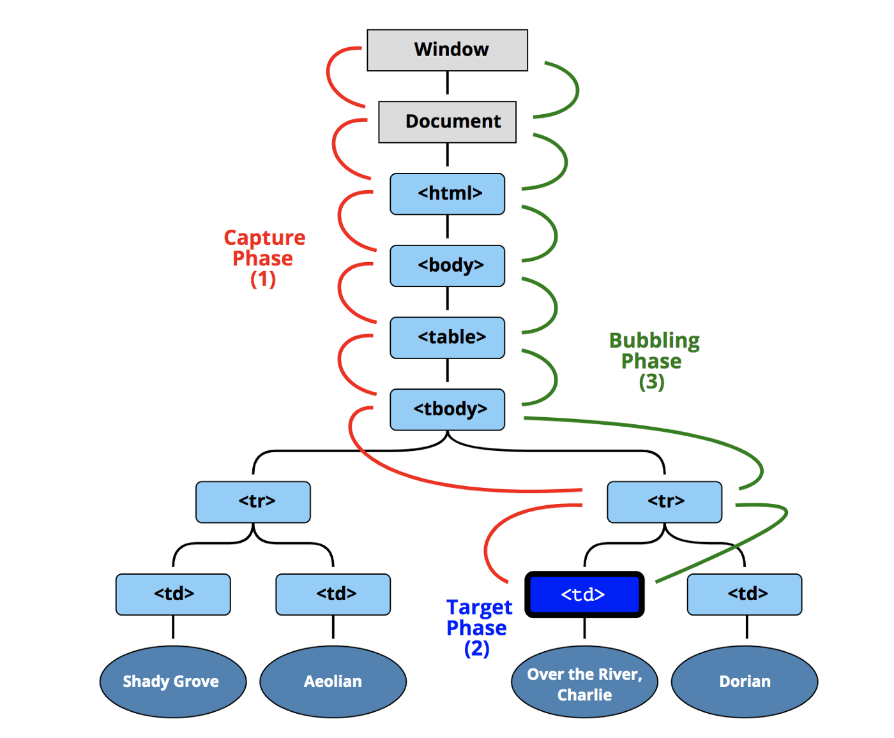

# [Curso de JavaScript avanzado para desarrolladores](https://fictizia.com/formacion/curso-javascript-avanzado)

## Clase 8

- Asincronía en JS
  * Como funciona
  * Event
  * Callbacks
  * Promesas

### Asincronia

Una de las características de JS, es que es monohilo. Esto, a nivel técnico, significa que JS sólo una cosa puede ocurrir a la vez. Es decir, JS SOLO puede procesar una sentencia cada vez en ese hilo.

Esto tiene sus ventajas y desventajas, ya que si bien no tienes que preocuparte de la concurrencia, hay ciertas acciones (llamadas http, procesamiento de imágenes, etc) que necesitan de más tiempo para procesarse y, por tanto, bloquean este hilo. Para que esto no sea un bloqueo, se utilizan cierto mecanismos de asincronía (callbacks, promises, async/await) que permiten desbloquear el hilo de ejecución.

```javascript
setTimeout(() => console.log('hola, hola'), 0)

console.log('Adios, adios')
```

#### La base

Antes de conocer estas herramientas, intentaremos entender cómo funciona la asincronía en el motor de JS.

Tomemos el siguiente código Javascript (100% síncrono) como ejemplo:

```javascript
const miSegunda = () => {
  console.log('Toh bien mano');
}

const miPrimera = () => {
  console.log('Qué pasa premoh');
  miSegunda();
  console.log('Que bueno pana');
}

miPrimera()
```


#### Contexto de ejecución

Es un concepto abstracto que se refiere al lugar donde el código JS se evalúa y se ejecuta. Todo el código JS se ejecuta en un contexto de ejecución. Cuando creamos una función se crea su propio contexto de ejecución de función, mientras que cuando tenemos código global, este se ejecuta en el contexto global.

#### Pila de llamadas

La pila de llamadas (o call stack) es una estructura LIFO (last in,first out) donde se almacenan todos los contextos creados durante la ejecución del código. Al ser monohilo, JS tiene una única pila de llamadas.

#### ¿Cómo se une esto?



1. Nuestro código empieza a ejecutarse, Se crea un contexto de ejecución global `main()` y se apila.
2. Aparece una llamada a la función `miPrimera()`. Así que se apila y comienza su ejecución.
3. Se comienza a ejecutar el nuevo contexto, así que se apila la llamada a `console.log()`.
4. Como la ejecución de `console.log()` ha acabado, desaparece de la pila.
5. Aparece una llamada a la función `miSegunda()`. Se apila y se empieza a ejecutar.
6. Se ejecuta `console.log()` y se añade a la pila.
7. Como la ejecución de `console.log()` ha acabado, desaparece de la pila.
8. Como la ejecución de `miSegunda()` ha acabado, desaparece de la pila.
9. Se ejecuta `console.log()` y se añade a la pila.
10. Como la ejecución de `console.log()` ha acabado, desaparece de la pila.
11. Como la ejecución de `miPrimera()` ha acabado, desaparece de la pila.
12. Como la ejecución de `main()` ha acabado, desaparece de la pila. Fin del programa.

#### ¿Qué pasa con el código asíncrono?

Si en este esquema hubiera una pieza de código que, por el motivo que sea, requiriera de más tiempo para ser ejecutada, nuestro código se vería lastrado por la ejecución de esta. Para solucionar este problema, es preciso que antes entendamos cómo y donde se ejecuta JS.

#### Entorno de ejecución

El entorno de ejecución hace referencia al lugar donde se ejecuta el código Javascript. Aunque tradicionalmente Javascript ha sido un lenguaje de Front que se ejecutaba en el navegador, desde la aparición de NodeJS también podemos ejecutarlo en Servidor. Esto hace que haya dos entornos diferentes que proveen de APIs concretas. Por un lado tenemos el navegador, que nos provee de una serie de APIs y de métodos propios orientados a tratar en un entorno como es el navegador. En el caso de NodeJs, este tiene una serie de APIs propias que son distintas a las del navegador, ya que el tipo de problemas que hay en un servidor no tienen por qué ser los mismos.

Por ejemplo, mientras que el navegador provee métodos específicos para el manejo del DOM, gestión de eventos o el famoso `Fetch`, estos no están presentes en NodeJs. Al igual, mientras que en NodeJs tenemos de forma nativa la manipulación de ficheros, esta no está presente en los navegadores. Sin embargo, funciones como `setTimeout` o `setInterval` están en ambos entornos de ejecución, pero no son parte del motor de JS.

Cuando creamos un manejador de eventos, este se guarda en el entorno correspondiente ya que los eventos no pertenecen al motor de Javascript.

#### Cola de mensajes

Es una cola (FIFO) donde se almacenan las funciones callback que se tienen que ejecutar en orden. Cuando no hay nada apilado en la pila de llamadas, la función callback se envía a la pila. Este proceso se repite tantas veces cómo callbacks haya encolados.

#### Loop de eventos

Este loop de eventos es el corazón de la asincronía de JS. Se encarga de comprobar constantemente el estado de la pila y de la cola de mensajes. En el momento en que la pila de llamadas se queda vacía, notifica a la cola de mensajes por si esta tuviera callbacks que ejecutar.

#### ¿Cómo se conecta todo esto?

Partamos de este código asíncrono en el que vamos a emular una llamada HTTP:

```javascript

const llamadaHTTP = () => {
  setTimeout(() => {
    console.log('Ha pasado un segundo y medio');
  }, 1500);
}

console.log('Inicio del programa');

llamadaHTTP();

console.log('Fin del programa')
```

Cuando se inicia la ejecución del programa ocurre lo siguiente:

1. Se apila el contexto de ejecución global en el call stack.
2. Se apila la invocación a `console.log`.
3. `console.log` acaba y se desapila.
4. Se apila la ejecución de `llamadaHTTP` y comienza su ejecución.
5. Se apila la llamada a `setTimeout`.
6. `setTimeout` crea un temporizador de 1 segundo y medio en el entorno de ejecución del navegador.
7. Como la ejecución de `setTimeout` ha acabado, se desapila.
8. Como no hay nada más que ejecutar en `llamadaHTTP`, se desapila.
9. Se apila la ejecución de `console.log()`
10. `console.log` acaba y se desapila.
11. Como ha pasado un segundo y medio el callback de `setTimeout` llega a la cola de mensajes.
12. Como la pila de llamadas está vacía, el event loop notifica a la cola y se apila en la pila de llamadas el callback del `setTimeout`.
13. Como la ejecución del `callback` ha acabado, esta se desapila.

[Demo](http://latentflip.com/loupe)

### Eventos

Los eventos nos permiten notificar a nuestro código que algo ha pasado y ejecutar código cuando estos ocurren. En los eventos hay dos partes involucradas siempre, por un lado, el disparador del evento, y por el otro lado, el manejador de ese evento. El primero será quien lance la notificación de que algo ha pasado mientras que el segundo será quien actúe cuando ese evento ocurra.

#### Propagación

El proceso por el que se propaga los eventos ocurre en 3 fases:

1. Fase de captura. Empezando desde el mayor de los ancestros (`window`). El evento va pasando por todos los hijos de forma profunda hasta llegar al elemento que ha disparado el evento.
2. Objetivo. El evento llega al disparador.
3. Fase de Bubbling: El evento vuelve desde el disparador hasta el ancestro más primitivo (`window`).

Por defecto, los eventos en el navegador se capturan en la fase de bubbling. Si queremos que se capturen también en la primera fase debemos indicarlo de forma explicita.



La forma en la que se propagan, da pie a lo que se llama delegación de eventos. Cuando queremos que una serie de elementos que son hermanos tengan el mismo manejador de eventos, podemos asignar este al elemento padre ya que cuando los eventos 'burbujeen', se capturarán de forma única.

#### Declaración

El DOM nos provee de una cantidad ingente de disparadores de eventos que podemos manejar. Esto lo podemos hacer de tres formas distintas:

- Manejadores de eventos inline: Este es el acercamiento menos recomendado de todos y el más antiguo.

```html
  <button onclick="cambiaFondo()">¡Pulsa Aquí!</button>


  <script>
    function cambiaFondo() {
      // magia
    }
  </script>
```

- Con la función `.addEventListener`. Esta función nos permite capturar los eventos en la fase de captura. Tiene su complementaria `removeEventListener`.

```html
  <button id="miBoton">¡Pulsa Aquí!</button>


  <script>

    function cambiaFondo() {
      // aquí ocurren cosas mágicas
    }

    const miBoton = document.querySelector('#miBoton')
    miBoton.addEventListener('click', cambiaFondo)
  </script>
```

```html
<div id="papa">
  <div id="hijo">
    Pulsa aquí
  </div>
</div>


<script>
const padre = document.getElementById('papa');
const hijo = document.getElementById('hijo');

hijo.addEventListener('click', function(event) {
  alert('Hijo ha llegado a la fase de bubbling');
});

papa.addEventListener('click', function(event) {
  alert('Papa ha llegado a la fase de bubbling');
  console.log(event);
});

hijo.addEventListener('click', function(event) {
  alert('Hijo ha llegado a la fase de captura');
}, true);

papa.addEventListener('click', function(event) {
  alert('Papa ha llegado a la fase de captura');
}, true);
</script>
```

- Modificando los manejadores por defecto de eventos:

```html
  <button id="miBoton">¡Pulsa Aquí!</button>


  <script>

    function cambiaFondo() {
      // aquí ocurren cosas mágicas también
    }

    const miBoton = document.querySelector('#miBoton');
    miBoton.onclick = cambiaFondo;
  </script>
```

#### Objeto Event

Cuando se captura un evento, la función de callback que actúa de manejador recibirá un objeto evento con una serie de propiedades y métodos muy interesantes. Algunos de ellos son los siguientes:

- Propiedades
  - `.type`: El nombre del evento que estamos capturando.
  - `.target`: Devuelve una referencia al objeto desde donde se envió el evento.
  - `.cancelable`: Indica si un evento se puede cancelar o no.
  - `.eventPhase`: Nos devuelve un entero que identifica en qué punto de la propagación del evento nos encontramos:
    - `0`: No se está procesando ningún evento.
    - `1`: Nos indica que está en la fase de captura.
    - `2`: El evento ha llegado al disparador del evento.
    - `3`: El evento está en estado de `bubbling`.
  - `.isTrusted`: Nos indica si un evento ha sido lanzado por la acción del usuario o de forma programática.
  - `.bubbles`: Indica si el evento se propaga hacia arriba o no.
  - `.currentTarget`: Devuelve una referencia al elemento que tiene asignado el manejador de eventos.

- `.preventDefault()`: Cancela el evento, es decir, evita el comportamiento por defecto para un manejador. Por ejemplo, un enlace que va a una nueva URL o un botón de tipo `submit`.

- `.stopPropagation()`: Evita que el evento se propague por el DOM hacia arriba, pero permite la acción por defecto.

#### Eventos personalizados

Independientemente de los eventos que lanza el DOM, nosotros podemos crear nuestros eventos personalizados y lanzarlos y capturarlos a voluntad. El constructor de la clase event puede recibir dos parámetros, aunque el segundo es opcional.

```javascript
const miEventoCustom = new Event('miEvento')

const miEventoComplejo = new Event('miEventoComplejo', {
  bubbles: false, // Indica si el evento burbujea
  cancelable: false, // Indica si el evento se puede cancelar
  composed: false // Indica si el evento se podrá escuchar fuera de un shadow root
})

document.body.addEventListener('miEventoComplejo', function(event) {
  console.log(event);
});

document.body.dispatchEvent(miEventoComplejo);
```


```html
<ul id="list">
  <ul>
    <li class="listItem">
      <div class="card">
      </div>
    </li>
    <li class="listItem">Nosotros</li>
    <li class="listItem">Contacta</li>
  </ul>
</ul>

<script>
  const miEventoComplejo = new Event('miEventoComplejo', {
    bubbles: false, // Indica si el evento burbujea
    cancelable: false, // Indica si el evento se puede cancelar
    composed: false // Indica si el evento se podrá escuchar fuera de un shadow root
  })

  document.body.addEventListener('miEventoComplejo', function(event) {
    console.log(event);
  });

  document.body.dispatchEvent(miEventoComplejo);
</script>
```

Cuando se trabaja con eventos, es muy típico usar algunos de los siguientes mecanismos:

- Throttling: Hay veces en que cierto evento se produce demasiadas veces consecutivas, activando su manejador por cada ocasión que esto ocurre. El throttling nos permite limitar el número de eventos ante el que reaccionamos, ya sea por tiempo o por número de veces que salta el evento.

```javascript
function throttler(delay, fn) {
  let ultimaLlamada;
  return function (...args) {
    const ahora = (new Date).getTime();
    if (ahora - ultimaLlamada < delay) {
      return;
    }
    ultimaLlamada = ahora;
    return fn(...args);
  }
}

const manejador = (evento) => console.log(evento)
const manejadorConThrottling = throttler(2000, manejador)

document.addEventListener('mousemove', manejadorConThrottling)
```

- Debounce: Esta técnica se utiliza en escenarios en los cuales se producirán muchos eventos muy rápido de un mismo tipo pero nosotros no queremos manejar todos, sólo el último de ellos. El debouncing nos permite esperar a que se dejen de producir eventos de un tipo para lanzar el manejador de los mismos.

```javascript
function debouncer(delay, fn) {
  let temporizador;
  return function (...args) {
    if (temporizador) {
      clearTimeout(temporizador);
    }
    temporizador = setTimeout(() => {
      fn(...args);
      temporizador = null;
    }, delay);
  }
}

const manejador = (evento) => console.log(evento)
const manejadorConDebounce = debouncer(1000, manejador)

document.addEventListener('mousemove', manejadorConDebounce)
```

#### Callbacks

Un callback es una función que se pasa como parámetro a otra función para que sea esta última la que la ejecute. Esta función puede estar previamente declarada o podemos declararla en el mismo momento que la pasamos como argumento. Es importante entender que al pasar la función no la estamos ejecutando. Es la función a la que le pasamos el callback la que decide cuando se ejecuta.

```javascript
// La función replace puede recibir una función de callback
// En este caso la declaramos al pasársela a la función replace
const conMayus = (str) => str.replace(/ [a-z]/g, (char) => char.toUpperCase())

// Pero también podríamos separarlas
const aMayus = letra => letra.toUpperCase();
const todoACapital = str => str.replace(/ [a-z]/g, aMayus)
```

```javascript
function filter(array, cb) {
  const nuevoArray = []
  for(let i = 0; i < array.length; i++) {
    if (cb(array[i], i, array)) {
      nuevoArray.push(array[i])
    }
  }
  return nuevoArray;
}
```

Cuando se trata de eventos, los manejadores son callbacks

```javascript
const miCallback = (evento) => console.log(evento.target)
document.body.addEventListener('click', miCallback)
```

También, podemos anidarlos.


[Demo](../ejemplos/clase8/index.html)

```html
<!DOCTYPE html>
<html>
<body>

  <button id="miBoton">Añade item</button>
  <ul id="miLista"></ul>

<script>
  window.addEventListener('DOMContentLoaded', function() {
    let contador = 1;
    const boton = document.getElementById('miBoton')
    const lista = document.getElementById('miLista')
    boton.addEventListener('click', function() {
      const nuevoLi = document.createElement('li');
      const contenido = document.createTextNode(`Item ${contador}`)
      nuevoLi.append(contenido)
      setTimeout(function() {
        lista.append(nuevoLi)
      }, 1500)
      contador += 1;
    })
  })
</script>
</body>
</html>`
```

El anidar callbacks nos lleva a lo que llamamos ***CALLBACK HELL** que es anidar la declaración de callbacks hasta convertir nuestro código en una pirámide egipcia MAL.
```javascript
const api = {
  get: function(ruta, cb) {
    setTimeout(function() {
      cb(null, { /* Los datos que queremos */ })
    })
  }
}

const traeDatosUsuario = (id, cb) => api.get(`/user/${id}`, cb)
const traeDatosCarrito = (id, cb) => api.get(`/cart/${id}`, cb)
const traeDatosMascota = (id, cb) => api.get(`/pet/${id}`, cb)
const traeDatosHeroe = (id, cb) => api.get(`/hero/${id}`, cb)
const traeImagen = (id, cb) =>  api.get(`/image/${id}`, cb)

function traeDatos() {
  traeDatosUsuario(idUsuario, (errorUsuario, usuario) => {
    // Cosas de Usuario
    traeDatosCarrito(idCarrito, (errorCarrito, carrito) => {
      // Cosas de carrito
      traeDatosMascota(idMascota, (errorMascota, mascota) => {
        // Cosas de mascota
        traeDatosHeroe(idHeroe, (errorHeroe, heroe) => {
          // Cosas de heroe
          traeImagen(idImagen, (errorImagen, imagen) => {
            // Invocamos a Ramses porque hemos llegado a la cima de la pirámide
          })
        })
      })
    })
  })
}
```

Anidar callbacks hasta que formen una piramide se considera una mala práctica en Javascript. Una forma de evitarlo es declarando funciones como variables en vez de a la hora de pasarlas como parámetro.

```javascript

const cbDeTraeImagen = (err, imagen) => {
  // Hago cosas
}

const cbDeTraeDatosHeroes = (err, heroe) => {
  // Hago cosas de heroe
  traeImagen(idImagen, cbDeTraeImagen);
}

const cbDeTraeDatosMascota = (err, mascota) => {
  // Hago cosas de mascota
  traeDatosHeroe(idHeroe, cbDeTraeDatosHeroes);
}

const cdDeTraeDatosCarrito = (err, carrito) => {
  traeDatosMascota(idMascota, cbDeTraeDatosMascota)
}

const cbDeTraeDatosUsuario = (err, usuario) => {
  // Cosas de usuario
  traeDatosCarrito(idCarrito, cdDeTraeDatosCarrito)
}

function traeDatos() {
  traeDatosUsuario(idUsuario, cbDeTraeDatosUsuario);
}
```

Esto puede presentar un problema, y es que queramos acceder a variables que esten declaradas dentro de la pirámide:

```javascript
function traeDatos(idUsuario, cb) {
  traeDatosUsuario(idUsuario, (errorUsuario, usuario) => {
    // Cosas de Usuario
    const { idMascota } = usuario
    traeDatosCarrito(idCarrito, (errorCarrito, carrito) => {
      // Cosas de carrito
      traeDatosMascota(idMascota, (errorMascota, mascota) => {
        // Cosas de mascota
        traeDatosHeroe(idHeroe, (errorHeroe, heroe) => {
          // Cosas de heroe
          traeImagen(idImagen, (errorImagen, imagen) => {
            // Invocamos a Ramses porque hemos llegado a la cima de la pirámide
            cb(null, resultado)
          })
        })
      })
    })
  })
}
```

Con el acercamiento que acabamos de ver, esto no sería posible, ya que estas variables no existen en el contexto de la función.

Hay diferentes formas de solucionar esto. Una forma de solucionarlo, sería que en nuestras funciones se arrastre siempre la información que sabemos que necesitaremos:

```javascript
const traeDatosUsuario = (params, cb) => {
  const { idUsuario } = params
  api.get(`/user/${idUsuario}`, (err, data) => {
    // Hacemos lo que sea
    cb(null, { ...params, usuario: data })
  })
}
const traeDatosCarrito = (params, cb) => {
  const { usuario: { idCarrito } } = params
  api.get(`/cart/${idCarrito}`, (err, data) => {
    // Hacemos lo que sea
    cb(null, { ...params, carrito: data })
  })
}

const traeDatosMascota = (params, cb) => {
  const { usuario: { idMascota } } = params
  api.get(`/pet/${idMascota}`, (err, data) => {
    // Hacemos lo que sea
    cb(null, { ...params, mascota: data })
  })
}


const traeDatosHeroe = (params, cb) => {
  const { mascota: { idHeroe } } = params
  api.get(`/hero/${idHeroe}`, (err, data) => {
    // Hacemos lo que sea
    cb(null, { ...params, heroe: data })
  })
}

const traeDatosImagen = (params, cb) => {
  const { heroe: { idImagen } } = params
  api.get(`/imagen/${idImagen}`, (err, data) => {
    // Hacemos lo que sea
    cb(null, { ...params, imagen: data })
  })
}
```

Si juntamos todo, tendríamos lo siguiente:

```javascript

const traeDatosUsuario = (params, cb) => {
  const { idUsuario } = params
  api.get(`/user/${idUsuario}`, (err, data) => {
    // Hacemos lo que sea
    cb(null, { ...params, usuario: data })
  })
}

const traeDatosCarrito = (params, cb) => {
  const { usuario: { idCarrito } } = params
  api.get(`/cart/${idCarrito}`, (err, data) => {
    // Hacemos lo que sea
    cb(null, { ...params, carrito: data })
  })
}

const cbDeTraeDatosUsuario = (err, datos) => {
  // Cosas de usuario
  traeDatosCarrito(datos, cdDeTraeDatosCarrito)
}

const traeDatosMascota = (params, cb) => {
  const { usuario: { idMascota } } = params
  api.get(`/pet/${idMascota}`, (err, data) => {
    // Hacemos lo que sea
    cb(null, { ...params, mascota: data })
  })
}

const cdDeTraeDatosCarrito = (err, datos) => {
  traeDatosMascota(datos, cbDeTraeDatosMascota)
}

const traeDatosHeroe = (params, cb) => {
  const { mascota: { idHeroe } } = params
  api.get(`/hero/${idHeroe}`, (err, data) => {
    // Hacemos lo que sea
    cb(null, { ...params, heroe: data })
  })
}

const cbDeTraeDatosMascota = (err, datos) => {
  // Hago cosas de mascota
  traeDatosHeroe(datos, cbDeTraeDatosHeroes);
}

const traeDatosImagen = (params, cb) => {
  const { heroe: { idImagen } } = params
  api.get(`/imagen/${idImagen}`, (err, data) => {
    // Hacemos lo que sea
    cb(null, { ...params, imagen: data })
  })
}

const cbDeTraeDatosHeroes = (err, datos) => {
  // Hago cosas de heroe
  traeImagen(datos, cbDeTraeImagen);
}

const cbDeTraeImagen = (err, imagen) => {
  // Hago cosas
}

function traeDatos(idUsuario) {
  traeDatosUsuario({ idUsuario }, cbDeTraeDatosUsuario);
}
```

#### Librerías

- [asyncjs](https://caolan.github.io/async/v3/docs.html)

### Enlaces de interés

- [✨♻️ JavaScript Visualized: Event Loop](https://dev.to/lydiahallie/javascript-visualized-event-loop-3dif)
